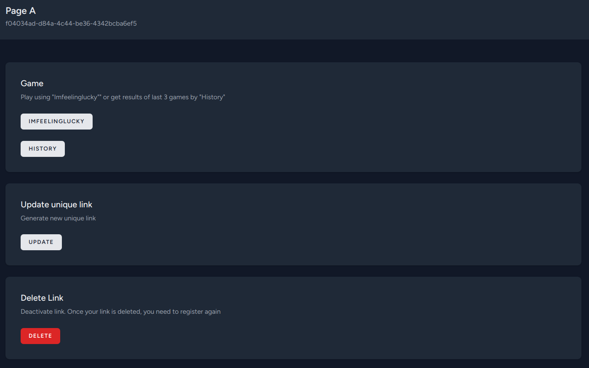
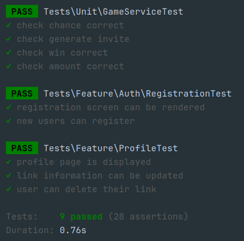

## Setup and Run

### Prerequisites
- Docker installed on your machine.
- (Optional) Make command line tool installed

### Steps to Run the Service

1. Build the Docker containers:

   ```bash
   docker-compose build --no-cache
   docker-compose up -d
   docker-compose exec -usail app composer install
   docker-compose exec -usail app composer run post-root-package-install
   docker-compose exec -usail app composer run post-create-project-cmd
   docker-compose exec -usail app npm install
   docker-compose exec app npm run build
   # or
   make build
   ```
2. Start the Docker containers:

   ```bash
   docker-compose up -d --force-recreate
   # or
   make up
   ```

3. The app will now be available at **http://localhost**
   


   You can change app or services port as you need in `.env` file by changing

      ```
      APP_PORT=80
      ```

   and then run

      ```bash
      docker-compose up -d --force-recreate
      #  or
      make up
      ```

## Run Tests

```bash
docker-compose exec app php artisan test
# or
make test
```
